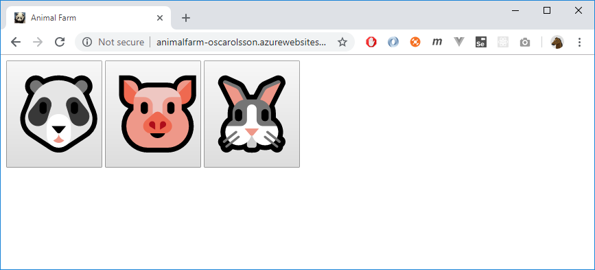
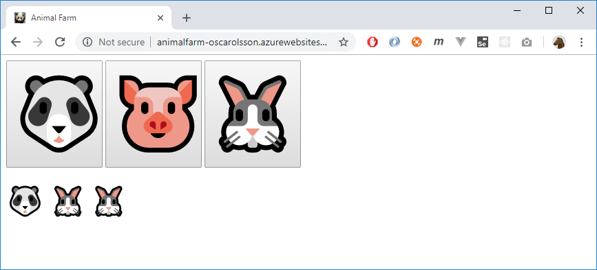
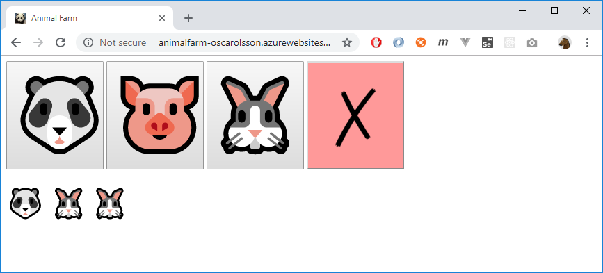

# Checkpoint - Animal farm

You're going to write a webapp for an animal farm.

Start with this project:

https://github.com/happy-bits/gbg/tree/master/Checkpoints/10/AnimalFarm

## Level 1

The app won't work right away. You have to do migrate the database first.

Then when you run the app it will look like this:

Press one of the three big buttons. Now a small animal will appear at the bottom. Below the user has pressed panda, rabbit, rabbit:

Publish the site and the database to *Azure*. Name your app *AnimalFarm-YourName* so the site will be reached at **animalfarm-yourname.azurewebsites.net**

## Level 2

Add a red button the user interface:

If the button is pressed all the animals will be erased from the database and the page should reflect that.

Next, use the configuration in **appsettings.json** to limit the type of animals that are allowed to be added.

This configuration:

	"SiteConfig": {
		"AllowedAnimalNames": [ "panda", "rabbit" ]
	}

...will just allow panda and rabbit (so nothing will happen if the user presses the pig)

(The three big buttons can be visible anyway)

Publish the site and the database to *Azure*. Name your app *AnimalFarm-YourName* so the site will be reached at **animalfarm-yourname.azurewebsites.net**